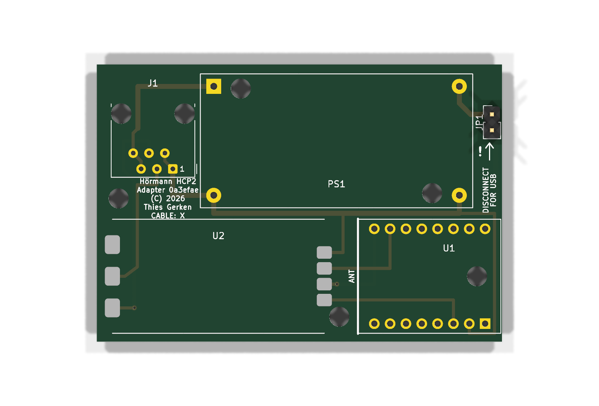

<div align="center">

# Hörmann HCP2 Adapter

**An open carrier PCB and 3D-printable enclosure for connecting an ESP32-C3 to a Hörmann Series 4 garage door opener.**


</div>

<table>
<tr>
<td width="34%" align="center"><br><strong>65 × 44.5 mm carrier PCB</strong></td>
<td width="33%" align="center"><br><strong>Ventilated lid</strong></td>
<td width="33%" align="center"><br><strong>Fitted electronics tray</strong></td>
</tr>
</table>

> [!CAUTION]
> Verify the pinout of your own opener and every conductor of your cable before connecting anything. See [Variants](#variants).
>
> Use this project entirely at your own risk. I am not responsible for any damage, injury, loss, or other consequence resulting from its use in any way. This independent project is not affiliated with, endorsed by, or sponsored by Hörmann.

This is the documentation repository for how I built my adapter around the [ESPHome Hörmann HCP component](https://esphome.io/components/cover/hoermann_hcp/). It may be useful for other people building one as well.

It includes:

- 🧩 a fully routed two-layer KiCad carrier PCB with project-specific footprints
- ⚙️ reproducible Python generators for the schematic, PCB, manufacturing outputs, and renders
- 📦 a compact, parametric build123d enclosure matched directly to the PCB geometry
- 🔌 a ready-to-flash ESPHome configuration with Wi-Fi provisioning
- 🖨️ printable STL files and 3MF assembly previews
- 📚 documented mechanical, electrical, and sourcing decisions

## BOM

### Electronics

| Qty. | Ref. | Component | Notes |
|---:|---|---|---|
| 1 | PCB | Carrier PCB | Two-layer, 65 × 44.5 mm; fabrication files are in [`pcb/`](pcb/) |
| 1 | U1 | [ESP32-C3 Super Mini](reference/docs/purchased-modules.md#esp32-c3-super-mini) | Socketed; runs ESPHome |
| 1 | PS1 | [LM2596 HW-411 buck converter](reference/docs/purchased-modules.md#lm2596-buck-converter-module) | Adjustable; set and verify 5.0 V before connecting U1 |
| 1 | U2 | [Isolated TTL-to-RS485 module](reference/docs/purchased-modules.md#isolated-ttl-to-rs485-module) | 3.3 V/5 V, automatic direction control, integrated 120 Ω termination |
| 1 | J1 | [Unshielded right-angle 6P6C jack](reference/docs/connector-rj12.md) | AliExpress item `1005003078110991`, option `6P6C` |
| 1 | JP1 | 1×2, 2.54 mm pin header and jumper shunt | Disconnects `BUS_PWR` before USB is connected |
| 2 | U1 sockets | 1×8, 2.54 mm socket headers | Keep U1 removable and provide clearance above H4 |
| 1 | W1 | [6P6C cable](reference/docs/purchased-modules.md#6p6c-cable) | Reversed for the `cross` board, straight-through for `straight`. See [Variants](#variants). Verify all six conductors before use |

### Enclosure

| Qty. | Component | Notes |
|---:|---|---|
| 1 | Printed `bottom.stl` | Tray with PCB supports and 6P6C opening |
| 1 | Printed `top.stl` | Ventilated lid |
| 7 | Ruthex M3 heat-set inserts, 5.7 mm long, Ø4.0 mm hole | Four for the lid columns and three for the PCB bosses |
| 4 | M3 × 6 socket cap screws | Lid. Anything longer than 7.5 mm bottoms out in the blind hole |
| 3 | M3 × 6 socket cap screws | PCB. Full thread engagement would need 7.3 mm, and 4.4 mm is ample for M3 |

The LM2596 is not galvanically isolated. The complete adapter therefore shares the HCP supply ground even though the RS485 signal path is isolated. Full galvanic isolation would require an isolated DC/DC converter.

## 🧩 PCB

The [`pcb/`](pcb/) directory is the electrical source of truth. It contains the shared net model, schematic and layout generators, custom footprints, generated KiCad projects, renders, ERC and DRC reports, and fabrication files.

| Property | Value |
|---|---|
| Board | 2 layers, 65 × 44.5 mm |
| Routing | 0.5 mm signals, 0.8 mm power, two vias, three on the straight variant |
| Input | Hörmann HCP2 through a 6P6C jack |
| Controller | Socketed ESP32-C3 Super Mini |
| Power | LM2596 module, approximately 25 V to 5 V |
| Bus interface | Isolated automatic-direction TTL-to-RS485 module |
| Mounting | Three M3 board holes plus one supported corner |

### Variants

Two boards are generated from the same sources. They are identical except for how the six
contacts of J1 map onto the nets, and each one says on its silkscreen which cable it wants.

| Variant | Silkscreen | Cable | J1 contacts |
|---|---|---|---|
| `cross` | `CABLE: X` | Reversed (rollover) | 1, 2 GND · 3 B- · 4 A+ · 5, 6 +25 V |
| `straight` | `CABLE: II` | Straight-through 1:1 | 1, 2 +25 V · 3 A+ · 4 B- · 5, 6 GND |

`cross` follows the pinout in the ESPHome documentation and is the board built and tested
here. The openers measured for this project are mirrored against that pinout, which is why
it needs a reversed cable. `straight` exists for anyone who would rather buy an ordinary
1:1 cable, and for openers that turn out to match it directly.

Measure your own opener before ordering either board. Getting this wrong puts +25 V on the
adapter's ground.

### Layout

| Reference | Part and placement |
|---|---|
| J1 | Amphenol 54601-compatible right-angle 6P6C jack, flush with the top board edge |
| PS1 | 43.4 × 21.2 mm LM2596 HW-411 module, input side toward J1 |
| U2 | 34 × 18 mm isolated RS485 module on castellated pads |
| U1 | ESP32-C3 Super Mini, USB-C flush with the right edge and antenna facing U2 |
| JP1 | `BUS_PWR` disconnect jumper for safe USB use |
| H1, H3, H4 | 3.2 mm M3 mounting holes aligned with the enclosure bosses |

### Generate the design

KiCad must be installed and `kicad-cli` must be available.

```sh
for variant in cross straight; do
  uv run python pcb/schematic.py $variant
  uv run python pcb/pcb.py $variant
done
```

The generators write editable KiCad files directly to [`pcb/`](pcb/), run ERC and DRC, render the schematic and both board sides, and package Gerber and Excellon data. Omitting the argument builds `cross`.

Useful outputs, per variant:

| | Reversed cable | Straight cable |
|---|---|---|
| Editable schematic | [`hcp-cross.kicad_sch`](pcb/hcp-cross.kicad_sch) | [`hcp-straight.kicad_sch`](pcb/hcp-straight.kicad_sch) |
| Schematic PDF | [`hcp-cross-schematic.pdf`](pcb/hcp-cross-schematic.pdf) | [`hcp-straight-schematic.pdf`](pcb/hcp-straight-schematic.pdf) |
| Editable PCB | [`hcp-cross.kicad_pcb`](pcb/hcp-cross.kicad_pcb) | [`hcp-straight.kicad_pcb`](pcb/hcp-straight.kicad_pcb) |
| Layer PDF | [`hcp-cross-pcb.pdf`](pcb/hcp-cross-pcb.pdf) | [`hcp-straight-pcb.pdf`](pcb/hcp-straight-pcb.pdf) |
| Gerber and drill archive | [`hcp-cross-gerbers.zip`](pcb/hcp-cross-gerbers.zip) | [`hcp-straight-gerbers.zip`](pcb/hcp-straight-gerbers.zip) |

The title blocks include the short Git hash of `HEAD`. For release artifacts, commit the sources first, regenerate all four designs, then commit the generated outputs.

## 📦 Enclosure

The [`enclosure/`](enclosure/) directory contains a two-part indoor enclosure generated with [build123d](https://build123d.readthedocs.io/):

- `bottom.stl`: tray with three PCB bosses, a support rail, corner columns, and the 6P6C opening
- `top.stl`: screw-fastened lid with a hexagonal ventilation pattern
- `preview.stl`: open assembly for any STL viewer
- `preview.3mf`: colored assembly with lid and internal hardware

The outer size is **87.8 × 54.3 × 34.0 mm**. Four M3 screws secure the lid into Ruthex threaded inserts. The enclosure is intended for an indoor garage wall and is not waterproof.

PCB dimensions, hole positions, and module placement are imported from [`pcb/pcb.py`](pcb/pcb.py) and the KiCad footprints. Only vertical dimensions and simplified component bodies are maintained separately.

```sh
uv sync
uv run python enclosure/case.py
uv run python enclosure/case.py --show
uv run python enclosure/case.py --png
uv run python enclosure/test_case.py
```

See the [enclosure documentation](enclosure/README.md) for print orientation, clearances, viewer setup, and the mechanical decisions behind the model.

## Assembly notes

Before soldering PS1 onto the carrier board:

1. Power the loose LM2596 module from approximately 25 V with no ESP32 connected.
2. Adjust its output to 5.0 V using the `103` trimmer.
3. Check startup and shutdown behavior under load. The output must not overshoot beyond 5.5 V.
4. Solder PS1 only after those checks pass. Keep `BUS_PWR` open until the remaining board is assembled.

U1 plugs into two 1×8 socket headers. Install the headers, fasten the PCB inside the enclosure, then insert the ESP32. Never connect USB while `BUS_PWR` links the externally supplied 5 V rail.

## HCP2 interface

The ESPHome documentation specifies this pinout for supported Hörmann Series 4 openers:

| Pin | Signal |
|---:|---|
| 1 | GND |
| 2 | GND |
| 3 | B- |
| 4 | A+ |
| 5 | +25 V |
| 6 | +25 V |

The opener's own jack is mirrored against that table: on the ProMatic 4 measured here,
+25 V sits on contacts 1 and 2. The `cross` board follows the table and therefore needs a
**reversed (rollover) cable**, the kind whose two plugs show opposite conductor order when
held identically. The `straight` board mirrors J1 instead and takes a plain 1:1 cable. See
[Variants](#variants).

Measure your opener and every conductor of your cable before the first connection. Pairing
the wrong cable with either board feeds +25 V into the adapter's ground. Doing that here
survived only because the opener limits accessory current to 350 mA.

UART settings: **57600 baud, 8 data bits, even parity, 1 stop bit**. ESPHome participates as a Modbus server. The configuration is in [`esphome/`](esphome/README.md) and uses `GPIO20` for TX and `GPIO21` for RX. That looks reversed next to the net
names on the board, and it is not: U2's TTL pads carry the module's own pin names, so
its `TX` pad drives the ESP32 rather than being driven by it.

## Troubleshooting

The bus offers a hostile debugging environment: it carries power only during a bus scan,
and the opener cuts it again within seconds when the adapter fails to register. That is
too short to read a log. These checks all work on the bench instead, with the board on a
25 V supply and the bus disconnected.

**Does the transmitter work?** Send continuously and measure the DC average, which a plain
multimeter resolves. A temporary `interval` writing 128 zero bytes every 30 ms keeps the
line low about 80 % of the time. Measure between U2's A and B pads:

| A against B | Meaning |
|---|---|
| about 185 mV, unchanged while sending | The driver never switches on. Check the pin roles first |
| moves to roughly 1.6 V while sending | Transmit path is good |
| exactly 0.000 V | The isolated side is not running. The module is dead or unpowered |

The 185 mV is the module's fail-safe bias, so seeing it at all proves the isolated side
has power.

**Does the receiver work?** With the bus disconnected, GPIO21 must sit at a steady 3.3 V.
That is U2's receiver output holding the UART idle level. A wandering level below 0.5 V
means the receiver output is not driving, or the castellated joint is cold.

**Is anything arriving from the bus?** Count bytes instead of logging them. A `uart:`
`debug:` block with a custom `sequence` replaces the default hex dump, so it costs no log
traffic, and a global written to flash with `global_preferences->sync()` survives the
supply being cut. Drive the onboard LED from it and the answer is readable in the garage
without a host attached. Set `dummy_receiver: true` while measuring so the counter does
not depend on Modbus draining the UART, and back to `false` for normal operation.

**Verify the counter before trusting it.** Point the UART at two free neighbouring pins,
GPIO4 and GPIO3, and bridge them. Crosstalk from the transmitting pin is enough to make
the counter run even without the bridge.

## ⚠️ Safety and operating constraints

- Scope is limited to supported Hörmann Series 4 HCP2 devices.
- Disconnect mains power and any emergency battery before installation.
- HCP2 accessories must not be connected or removed while powered.
- Interrupted communication or an ESPHome restart can temporarily block the opener. Power-cycling the opener clears this condition.
- The bus provides approximately 25 V only during a bus scan. The adapter must boot and respond in time.
- Verify the actual jack contact order and every conductor of the cable before first connection, and check that the cable matches the variant printed on the board.
- The selected RS485 module reportedly includes 120 Ω termination. Measure A-to-B resistance with power removed before use. Do not fit a second termination.
- Hörmann specifies a combined 350 mA accessory limit. Measure adapter startup and operating current.

## Repository map

```text
LICENSE              MIT, except for the archived third-party material
pcb/                 PCB, schematic, footprints, and fabrication outputs
enclosure/           Parametric enclosure source and printable files
esphome/             ESPHome configuration for the ESP32-C3
reference/docs/      Design records, component notes, and source analysis
reference/           Archived vendor pages, manuals, and datasheets
TODO.md              Open checks, currently none
```

Reference material is intentionally separated from the project deliverables. Start with [`pcb/`](pcb/), [`enclosure/`](enclosure/), and [`esphome/`](esphome/); use [`reference/docs/`](reference/docs/) when a design decision or source needs review.

## License

[MIT](LICENSE), covering the PCB, the enclosure, the generators, the ESPHome
configuration, and the documentation.

[`reference/`](reference/README.md) is excluded. It archives manuals, datasheets, and
vendor listings that belong to their respective owners, with the exception of
[`reference/docs/`](reference/docs/), which is mine and follows the license above.

## Documentation

- [Enclosure design](enclosure/README.md)
- [Firmware](esphome/README.md)
- [Open checks](TODO.md)
- [Components and sourcing status](reference/docs/components.md)
- [Purchased modules](reference/docs/purchased-modules.md)
- [Selected 6P6C jack](reference/docs/connector-rj12.md)
- [Hörmann manual analysis](reference/docs/hoermann-manuals.md)
- [Sources and references](reference/docs/references.md)
- [Decision log](reference/docs/decisions.md)
- [Local vendor archive](reference/README.md)
