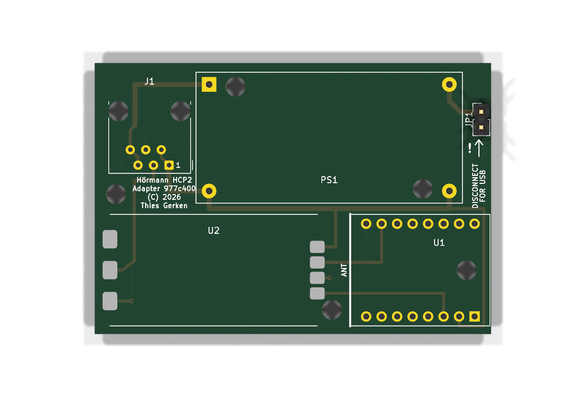
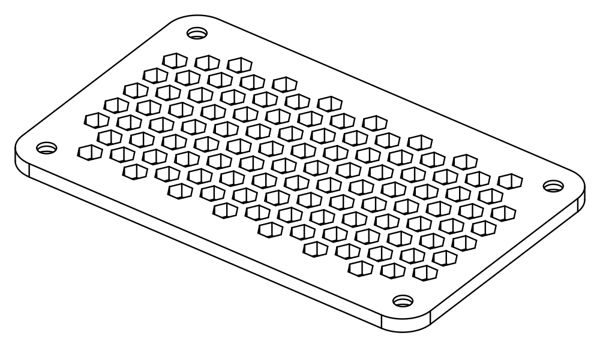
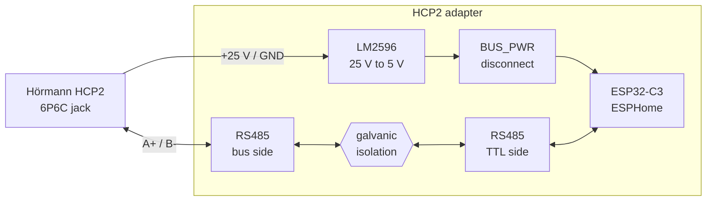

<div align="center">

# Hörmann HCP2 Adapter

**An open carrier PCB and 3D-printable enclosure for connecting an ESP32-C3 to a Hörmann Series 4 garage door opener.**


</div>

<table>
<tr>
<td width="50%" align="center"><br><strong>65 × 44.5 mm carrier PCB</strong></td>
<td width="50%" align="center"><br><strong>Parametric two-part enclosure</strong></td>
</tr>
</table>

> [!CAUTION]
> This is a prototype, not a fabrication-ready design. Module dimensions and the 6P6C jack pinout must be verified against the delivered parts before ordering a PCB or connecting it to an opener. See the [open checks](TODO.md).

## What this project provides

The value of this project is the hardware around readily available modules:

- a fully routed two-layer KiCad carrier PCB with project-specific footprints
- reproducible Python generators for the schematic, PCB, manufacturing outputs, and renders
- a compact, parametric build123d enclosure matched directly to the PCB geometry
- printable STL files and 3MF assembly previews
- documented mechanical, electrical, and sourcing decisions

The board connects four purchased assemblies:

- ESP32-C3 Super Mini running ESPHome
- adjustable LM2596 buck converter for approximately 25 V to 5 V
- isolated TTL-to-RS485 module with automatic direction control
- unshielded 6P6C modular jack for the Hörmann HCP2 bus



The LM2596 is not galvanically isolated. The complete adapter therefore shares the HCP supply ground even though the RS485 signal path is isolated. Full galvanic isolation would require an isolated DC/DC converter.

## 🧩 PCB

The [`pcb/`](pcb/) directory is the electrical source of truth. It contains the shared net model, schematic and layout generators, custom footprints, generated KiCad project, renders, ERC and DRC reports, and fabrication files.

| Property | Value |
|---|---|
| Board | 2 layers, 65 × 44.5 mm |
| Routing | 0.5 mm signals, 0.8 mm power, four vias |
| Input | Hörmann HCP2 through a 6P6C jack |
| Controller | Socketed ESP32-C3 Super Mini |
| Power | LM2596 module, approximately 25 V to 5 V |
| Bus interface | Isolated automatic-direction TTL-to-RS485 module |
| Mounting | Three M3 board holes plus one supported corner |

### Layout

| Reference | Part and placement |
|---|---|
| J1 | Amphenol 54601-compatible right-angle 6P6C jack, flush with the top board edge |
| PS1 | 43.4 × 21.2 mm LM2596 HW-411 module, input side toward J1 |
| U2 | 34 × 18 mm isolated RS485 module on castellated pads |
| U1 | ESP32-C3 Super Mini, USB-C flush with the right edge and antenna facing U2 |
| JP1 | `BUS_PWR` disconnect jumper for safe USB use |
| H1, H3, H4 | 3.2 mm M3 mounting holes aligned with the enclosure bosses |

### Generate the design

KiCad must be installed and `kicad-cli` must be available.

```sh
uv run python pcb/schematic.py
uv run python pcb/pcb.py
```

The generators write editable KiCad files to [`pcb/generated/`](pcb/generated/), run ERC and DRC, render the schematic and both board sides, and package Gerber and Excellon data.

Useful outputs:

- [editable schematic](pcb/generated/hcp.kicad_sch)
- [schematic PDF](pcb/generated/hcp-schematic.pdf)
- [editable PCB](pcb/generated/hcp.kicad_pcb)
- [layer PDF](pcb/generated/hcp-pcb.pdf)
- [Gerber and drill archive](pcb/generated/hcp-gerbers.zip)

The title blocks include the short Git hash of `HEAD`. For release artifacts, commit the sources first, regenerate both designs, then commit the generated outputs.

## 📦 Enclosure

The [`enclosure/`](enclosure/) directory contains a two-part indoor enclosure generated with [build123d](https://build123d.readthedocs.io/):

- `bottom.stl`: tray with three PCB bosses, a support rail, corner columns, and the 6P6C opening
- `top.stl`: screw-fastened lid with a hexagonal ventilation pattern
- `preview.stl`: open assembly for any STL viewer
- `preview.3mf`: colored assembly with lid and internal hardware

The outer size is **87.8 × 54.3 × 34.0 mm**. Four M3 screws secure the lid into Ruthex threaded inserts. The enclosure is intended for an indoor garage wall and is not waterproof.

PCB dimensions, hole positions, and module placement are imported from [`pcb/pcb.py`](pcb/pcb.py) and the KiCad footprints. Only vertical dimensions and simplified component bodies are maintained separately.

```sh
uv sync
uv run python enclosure/case.py
uv run python enclosure/case.py --show
uv run python enclosure/case.py --png
uv run python enclosure/test_case.py
```

See the [enclosure documentation](enclosure/README.md) for print orientation, clearances, viewer setup, and the mechanical decisions behind the model.

## Assembly notes

Before soldering PS1 onto the carrier board:

1. Power the loose LM2596 module from approximately 25 V with no ESP32 connected.
2. Adjust its output to 5.0 V using the `103` trimmer.
3. Check startup and shutdown behavior under load. The output must not overshoot beyond 5.5 V.
4. Solder PS1 only after those checks pass. Keep `BUS_PWR` open until the remaining board is assembled.

U1 plugs into two 1×8 socket headers. Install the headers, fasten the PCB inside the enclosure, then insert the ESP32. Never connect USB while `BUS_PWR` links the externally supplied 5 V rail.

## HCP2 interface

The ESPHome documentation specifies this pinout for supported Hörmann Series 4 openers:

| Pin | Signal |
|---:|---|
| 1 | GND |
| 2 | GND |
| 3 | B- |
| 4 | A+ |
| 5 | +25 V |
| 6 | +25 V |

UART settings: **57600 baud, 8 data bits, even parity, 1 stop bit**. ESPHome participates as a Modbus server.

## ⚠️ Safety and operating constraints

- Scope is limited to supported Hörmann Series 4 HCP2 devices.
- Disconnect mains power and any emergency battery before installation.
- HCP2 accessories must not be connected or removed while powered.
- Interrupted communication or an ESPHome restart can temporarily block the opener. Power-cycling the opener clears this condition.
- The bus provides approximately 25 V only during a bus scan. The adapter must boot and respond in time.
- Verify the actual jack contact order and every conductor of the straight-through 6P6C cable before first connection.
- The selected RS485 module reportedly includes 120 Ω termination. Measure A-to-B resistance with power removed before use. Do not fit a second termination.
- Hörmann specifies a combined 350 mA accessory limit. Measure adapter startup and operating current.

## Repository map

```text
pcb/                 PCB, schematic, footprints, and fabrication outputs
enclosure/           Parametric enclosure source and printable files
reference/docs/      Design records, component notes, and source analysis
reference/           Archived vendor pages, manuals, and datasheets
TODO.md              Measurements and commissioning checks still required
```

Reference material is intentionally separated from the two project deliverables. Start with [`pcb/`](pcb/) and [`enclosure/`](enclosure/); use [`reference/docs/`](reference/docs/) when a design decision or source needs review.

## Documentation

- [Enclosure design](enclosure/README.md)
- [Open checks](TODO.md)
- [Components and sourcing status](reference/docs/components.md)
- [Purchased modules](reference/docs/purchased-modules.md)
- [Selected 6P6C jack](reference/docs/connector-rj12.md)
- [Hörmann manual analysis](reference/docs/hoermann-manuals.md)
- [Sources and references](reference/docs/references.md)
- [Decision log](reference/docs/decisions.md)
- [Local vendor archive](reference/README.md)
