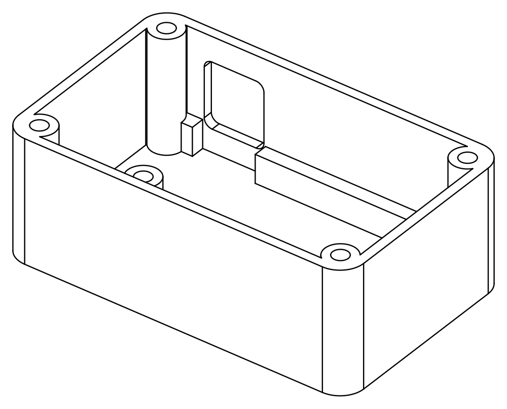

# 📦 Parametric enclosure

A compact 3D-printable enclosure for the carrier PCB in [`../pcb/`](../pcb/).
The model is fully parametric Python built with [build123d](https://build123d.readthedocs.io).

<table>
<tr>
<td width="50%" align="center"><br><strong>Ventilated screw-fastened lid</strong></td>
<td width="50%" align="center"><br><strong>Tray with PCB supports and connector opening</strong></td>
</tr>
</table>

The enclosure has two parts: `bottom.stl`, the tray, and `top.stl`, the lid with a hexagonal ventilation pattern. Four M3 screws fasten the lid into Ruthex threaded inserts in the corner columns. The PCB sits on three bosses below H1, H3, and H4, while a rail supports the remaining corner near the jack. There is no gasket because the enclosure is not waterproof.

**Outer size:** 87.8 × 54.3 × 34.0 mm  
**Inner size:** 83 × 49.5 × 28.8 mm

`case.py` reads the board dimensions, hole pattern, and module locations directly from [`../pcb/pcb.py`](../pcb/pcb.py) and the footprints in `../pcb/HCP.pretty/`. Only component heights and simplified module bodies are maintained manually.

> [!WARNING]
> This is a prototype. The PCB has not been manufactured and all module heights come from vendor data. Values requiring measurement are marked `UNVERIFIED` in the code. Measure the delivered modules and update the parameter block in `case.py` before printing the final enclosure.

## Workflow

```sh
uv sync                              # install build123d and ocp-vscode once
uv run python enclosure/case.py       # write the STL and 3MF files
uv run python enclosure/case.py --show
uv run python enclosure/case.py --png
uv run python enclosure/test_case.py  # verify clearances and fit constraints
```

Every run prints the bounding box and volume of both parts. Outputs are written beside the script:

- `bottom.stl` and `top.stl`: print-ready parts
- `preview.stl`: tray, PCB, modules, and plug for generic STL viewers
- `preview.3mf`: named and colored assembly including the lid, with transparency where supported

### Live viewer

Start the viewer in a separate terminal and leave it running:

```sh
uv run python -m ocp_vscode
```

Open <http://127.0.0.1:3939/viewer>, or use the OCP CAD Viewer extension in VS Code. Each `--show` invocation replaces the model while preserving the camera position. Hide the lid in the object tree to inspect the PCB, module envelopes, solder joints, mounting hardware, and inserted 6P6C plug.

The `--png` option renders isometric line drawings without hidden edges. It requires `rsvg-convert`, available on macOS through `brew install librsvg`.

## Layout

Top view with +Y upward. The PCB orientation matches the KiCad render. J1 faces the +Y wall and the U1 USB-C connector faces +X without an external opening.

```text
          ╡ 6P6C ╞
   ┌─────────────────────────────┐
   │ o                         o │   o = corner column with M3 insert
   │   [J1] [   PS1 LM2596   ]JP1│
   │   [ U2 RS485 ] [U1 ESP32-C3]│
   │ o                         o │
   └─────────────────────────────┘
```

## Dimensions

| Feature | Dimension or constraint |
|---|---|
| Walls and floor | 2.4 mm, equal to six 0.4 mm extrusion widths |
| Lid | 2.8 mm |
| PCB | 65 × 44.5 × 1.6 mm, Ø3.2 mm holes from `pcb.py` |
| PCB bosses | 3 × Ø8 × 7.2 mm below H1, H3, H4; Ø4.0 × 6.7 mm blind holes for Ruthex M3 inserts; 1 mm foot fillet |
| Support rail | Along the +Y wall between columns, interrupted at the jack; 3.5 mm deep and 1.5 mm below the PCB edge |
| PCB clearance | 9 mm at ±X, 2 mm toward the jack at +Y, 3 mm at -Y |
| Height above PCB | 16 mm reserved, plus 4 mm lid clearance |
| Jack J1 | 13.2 × 18 mm from the footprint, 11.65 mm high per vendor drawing, latch toward PCB |
| Plug opening | 15.2 × 16.65 mm, 2 mm corner radius, from 3 mm below to 2 mm above the jack |
| Ventilation | 4 mm hexagons across flats, 1.6 mm webs, 2 mm margin from wall rim and screw recesses |
| Lid screws | 4 × M3, Ø3.4 mm clearance, Ø6 × 2 mm counterbore |

## Mechanical decisions

### 9 mm side clearance

The clearance accommodates the corner columns. Components occupy all four PCB corners, so each column must sit beside the board instead of above it. A narrower enclosure would require moving the lid screws or reducing `column_reach` through a smaller `corner_radius`.

### 2.4 mm walls

This small indoor enclosure does not need the 3.2 mm walls used for larger sealed outdoor boxes. Commercial small enclosures commonly use 2 to 2.5 mm walls. The columns overlap 2 mm into the wall and remain within the outer profile.

### One external opening

USB-C remains inside. Remove the lid for flashing and disconnect `BUS_PWR` before connecting USB. JP1 is internal as well. An external USB cutout can be added in `build_bottom()` if operational access becomes necessary.

### Three bosses and one support rail

The PCB has three suitable mounting holes. There is no room for an Ø8 mm boss near the PS1 pads in the fourth corner, so that corner rests on the +Y support rail. Boss faces must remain clear of solder joints. `test_case.py` derives the required boss clearance from every footprint pad using boss radius, pad radius, and a 0.25 mm margin.

### Opening extends below the PCB

The jack latch faces the PCB. The plug lever therefore passes below the plug body and needs clearance beneath the jack face. The support rail is interrupted at the opening, while nearby boss H1 supports the PCB edge.

### 7.2 mm bosses

The Ruthex insert length determines boss height, not the 2 mm solder-joint clearance. The blind hole must remain inside the boss because the floor is too thin to receive the insert.

### 1 mm boss fillet

The bosses sit close to walls, the support rail, and corner columns. A 1 mm fillet avoids collisions. `test_case.py` checks every fillet envelope.

### Lid-only ventilation

Warm air rises, while solid tray walls retain stiffness. The hex grid is clipped to the internal opening so the lid bears continuously on the wall rim and leaves sufficient material around screw recesses.

## Before the final print

- Measure the installed heights of the LM2596 including capacitors, the socketed ESP32 including USB-C, and jack J1. Compare the largest value plus clearance with `parts_height`.
- Verify the physical jack height against the 11.65 mm drawing value in `jack_height`.
- Trial-fit a 6P6C plug. The 18 mm deep jack leaves little plug body outside the wall. Confirm that the latch remains reachable through the opening extension below the jack.
- Check the unsupported upper-right PCB corner for play after assembly. It rests only on the support rail.
- Choose PETG or PLA. The enclosure is intended for an indoor garage wall.

## Files

```text
case.py        Parametric model and user-facing dimensions
outputs.py     STL, 3MF, PNG, and live-view exports
test_case.py   Clearance and simplified assembly checks
bottom.stl     Print-ready tray
top.stl        Print-ready lid, oriented on its exterior face
preview.stl    Open assembly for viewing only
preview.3mf    Colored complete assembly for viewing only
```
